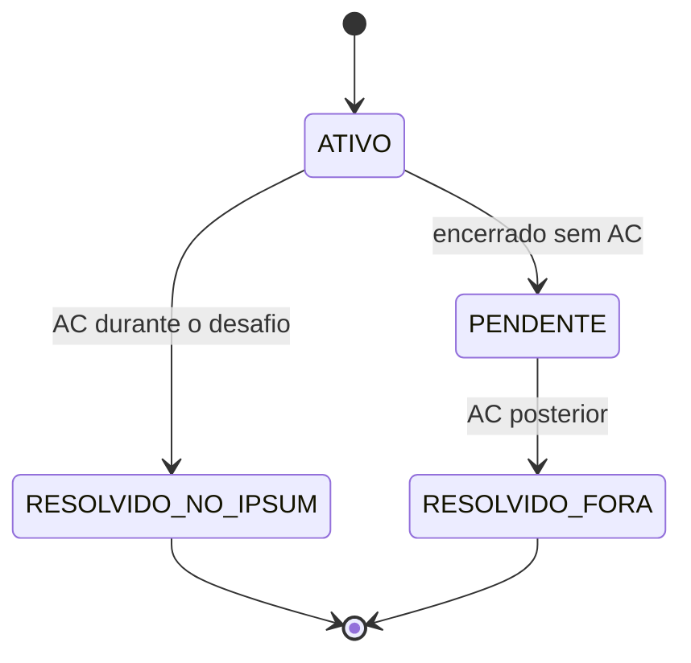

# AGENTS.md - Guia vivo do projeto Lorem

> Este arquivo e a fonte de verdade do produto, do escopo e do progresso do Lorem.
> Toda IA ou pessoa que trabalhar no repositorio deve le-lo inteiro antes de alterar o codigo.
> Ao terminar uma sessao, atualize o checklist, as decisoes e o registro da sessao.

## 1. Como a IA deve trabalhar neste projeto

### Antes de programar

1. Leia este arquivo inteiro.
2. Inspecione o codigo existente e confirme o que ja esta implementado.
3. Localize a primeira historia incompleta em **Trilha de implementacao**.
4. Trabalhe somente nessa historia e em pre-requisitos indispensaveis.
5. Apresente um microplano de 3 a 7 passos antes de editar o codigo.
6. Nao invente requisitos. Registre duvidas em **Decisoes abertas**.

### Durante a implementacao

- Prefira uma pequena entrega funcionando de ponta a ponta a varias telas incompletas.
- Preserve a arquitetura e os padroes ja existentes.
- Nao adicione dependencia, backend ou abstracao sem necessidade concreta.
- Nao implemente itens de **Fora do escopo**.
- Nao altere uma regra de produto silenciosamente.
- Use dados falsos apenas quando estiverem claramente isolados do fluxo real.
- Respeite o limite publico da API do Codeforces: no maximo uma requisicao a cada dois segundos.

### Antes de considerar uma historia concluida

1. Execute os testes relacionados.
2. Execute build e verificacoes disponiveis.
3. Teste manualmente os criterios de aceite.
4. Marque `[x]` apenas no que foi realmente verificado.
5. Atualize **Estado atual**, **Registro de decisoes** e **Registro de sessoes**.
6. Informe o que foi feito, como foi verificado e qual e o proximo item.

### Significado do checklist

- `[ ]`: ainda nao comprovado, mesmo que exista codigo parcial.
- `[x]`: implementado e verificado pelos criterios de aceite.
- `BLOQUEADO:`: depende de informacao, decisao ou recurso externo.

Nunca marque a historia principal como concluida enquanto algum criterio obrigatorio estiver pendente.

---

## 2. Visao do produto

**Lorem** e um aplicativo Android de treino individual para programacao competitiva.

O aplicativo recomenda um exercicio inedito do Codeforces de acordo com o nivel do usuario, inicia um desafio cronometrado chamado **Ipsum**, acompanha as submissoes e produz feedback sobre dificuldade, tempo, uso de dica, rating e assuntos praticados.

### Problemas que o Lorem resolve

- O usuario nao quer escolher manualmente qual exercicio praticar.
- Exercicios aleatorios podem ser inadequados ao nivel atual.
- Resolver sempre os mesmos estilos cria uma falsa sensacao de dominio.
- O rating oficial do Codeforces depende de contests e nao mede diretamente o treino avulso.
- O usuario precisa aprender a administrar o tempo de resolucao.
- Problemas nao resolvidos precisam permanecer visiveis para estudo e upsolve.

### Publico principal

Competidores de nivel iniciante-intermediario ou intermediario que ja utilizam o Codeforces, desejam praticar com frequencia e querem feedback sobre sua capacidade real fora de contests.

### Promessa central

> Guiar o usuario por exercicios variados e adequados ao seu nivel ate que ele se torne confortavel com diferentes raciocinios em tempo de competicao.

### Prioridades do projeto

1. Fluxo completo do Ipsum funcionando.
2. Correcao dos dados e das regras.
3. Utilidade real para o treinamento.
4. Simplicidade de desenvolvimento e manutencao.
5. Aparencia visual.

---

## 3. Escopo fechado

### Dentro do escopo

- Um perfil local ligado a um handle publico do Codeforces.
- Consulta ao catalogo de problemas e ao historico de submissoes.
- Exclusao de qualquer exercicio ja tentado ou resolvido pelo usuario.
- Recomendacao automatica de um exercicio.
- Apenas um Ipsum ativo por vez.
- Cronometro persistente.
- Tags escondidas, com opcao de revela-las como dica.
- Verificacao das submissoes feitas durante o Ipsum.
- Resultado e alteracao do rating interno.
- Historico de resolvidos durante Ipsums.
- Lista de problemas encerrados sem AC.
- Deteccao de AC obtido posteriormente, fora do Ipsum.
- Estatisticas por rating, tempo, resultado, dica e tags oficiais do Codeforces.
- Recomendacao que favorece variedade e pontos fracos.
- Indicacao de consolidacao da faixa de rating.

### Fora do escopo

- Equipes, duelos ou ranking entre usuarios.
- Contests, simulados ou treinos coletivos dentro do aplicativo.
- Chat, editorial ou geracao de dicas por inteligencia artificial.
- Tags criadas manualmente pelo Lorem.
- Editor ou compilador de codigo dentro do aplicativo.
- XP, moedas, streaks, conquistas ou loja.
- Login com senha, rede social ou backend proprio, salvo decisao posterior registrada.
- Firebase, sincronizacao em nuvem ou multiplos dispositivos, salvo decisao posterior registrada.
- Recursos especulativos apresentados como "versao futura".

---

## 4. Glossario e regras de dominio

- **Lorem:** o aplicativo inteiro.
- **Ipsum:** uma tentativa oficial e cronometrada de resolver um problema recomendado.
- **Rating Lorem:** estimativa interna da capacidade individual do usuario fora de contests.
- **Rating Codeforces:** dificuldade atribuida pelo Codeforces a um problema ou rating competitivo oficial do usuario. Nao confundir com o Rating Lorem.
- **Dica de topicos:** revelacao das tags oficiais do problema no Codeforces.
- **Tentado anteriormente:** problema que possui qualquer submissao anterior ao inicio do Ipsum, com qualquer veredito.
- **Resolvido no Ipsum:** primeiro AC ocorreu entre o inicio e o encerramento daquele Ipsum.
- **Pendente:** Ipsum encerrado sem AC.
- **Resolvido fora do Ipsum:** problema pendente que recebeu AC posteriormente.
- **Rating estimado:** valor numerico calculado pelas tentativas recentes.
- **Faixa consolidada:** maior faixa na qual o usuario demonstrou consistencia e variedade suficientes.

### Identidade de um problema

Sempre identificar um problema pela combinacao estavel fornecida pelo Codeforces, preferencialmente `contestId + index`. Nunca usar apenas o nome.

### Estados permitidos de um Ipsum



Regras invariantes:

- So pode existir um Ipsum ativo.
- Submissoes anteriores ao inicio nunca contam para o Ipsum atual.
- Um Ipsum encerrado nao pode alterar o rating pela segunda vez.
- Resolver posteriormente move o item de lista, mas nao reavalia o rating original.
- Rating, tags e categoria do sorteio ficam escondidos enquanto o Ipsum esta ativo.

---

## 5. Regras confirmadas de recomendacao

Considere `R` como o Rating Lorem atual.

### Distribuicao de dificuldade

- 1/3 de chance de **fluencia**: `max(800, R - 200)` ou `max(800, R - 100)`.
- 1/3 de chance de **nivel atual**: aproximadamente `R`.
- 1/3 de chance de **desafio**: `R + 100` ou `R + 200`.

A categoria sorteada nao deve ser mostrada durante o Ipsum.

### Filtros obrigatorios

O problema precisa:

- possuir rating;
- nunca ter recebido submissao anterior do usuario;
- nunca ter participado de outro Ipsum;
- nao estar pendente;
- nao ser o problema do Ipsum ativo.

### Prioridade de variedade

Depois dos filtros e da faixa de dificuldade, favorecer nesta ordem:

1. tags nunca praticadas;
2. tags pouco praticadas;
3. tags com maior taxa de falha;
4. tags nas quais o usuario usa dica com frequencia;
5. tags ja dominadas.

Usar apenas tags oficiais do Codeforces. Um problema com varias tags contribui para todas elas. A IA nao deve inventar uma taxonomia paralela.

### Quando nao houver candidato exato

Nao retornar erro imediatamente. Procurar progressivamente nos ratings vizinhos em passos de 100, mantendo todos os filtros de ineditismo. Registrar qual fallback foi utilizado. Os limites exatos desse fallback ainda estao em **Decisoes abertas**.

---

## 6. Dados minimos a preservar

Os nomes tecnicos podem mudar, mas o sistema precisa representar:

- **Perfil:** handle, Rating Lorem, faixa consolidada e ultima sincronizacao.
- **Problema:** `contestId`, `index`, nome, rating, tags e URL.
- **Ipsum:** problema, rating inicial, categoria, horarios, estado, dica, submissoes, erros, tempo, motivo do fracasso, variacao de rating e eventual AC posterior.
- **Desempenho por tag:** tentativas, AC no Ipsum, pendencias, uso de dica, tempo medio e faixa de rating.

---

## 7. Base tecnica recomendada

Opcao inicial para manter o TCC simples; preservar outra estrutura se o repositorio ja possuir uma funcional:

- Kotlin, Compose, um modulo, ViewModel + StateFlow e Coroutines.
- Room para dados estruturados e DataStore para pequenas configuracoes.
- Cliente HTTP centralizado, Navigation Compose e injecao manual simples.
- Sem Hilt ou backend proprio apenas por padrao.

### Endpoints necessarios do Codeforces

- `user.info`: validar e carregar o usuario.
- `user.status`: importar e atualizar submissoes.
- `problemset.problems`: carregar problemas, ratings e tags.

A API publica retorna `OK` ou `FAILED` e permite no maximo uma chamada a cada dois segundos. Centralizar chamadas e limitar a frequencia; nao deixar cada tela consultar livremente.

### Comandos de verificacao esperados

Este repositorio nao versiona o Gradle Wrapper para evitar artefatos binarios. Use Gradle 8.11 ou superior com Java 17:

```bash
gradle test
gradle lint
gradle assembleDebug
```

No Windows sem WSL, use os mesmos comandos em um terminal no qual o Gradle esteja disponivel no `PATH`.

---

## 8. Estado atual

**Foco atual:** Historia 01 - Vincular o handle do Codeforces.

**Ultima historia verificada:** Historia 00 - Estrutura basica.

**Proxima entrega demonstravel:** vincular e persistir um handle valido do Codeforces.

**Bloqueios conhecidos:** nenhum.

---

## 9. Trilha de implementacao

O desenvolvimento segue o ciclo: especificar a historia, planejar a menor mudanca, implementar, verificar e somente entao marcar como concluida.

### Historia 00 - Estrutura basica

**Historia:** Como desenvolvedor, quero uma base pequena e testavel para implementar o fluxo completo sem retrabalho.

#### Checklist

- [x] Criar ou confirmar o projeto Android com Kotlin e Compose.
- [x] Definir pacotes ou camadas para dados, dominio e interface.
- [x] Criar navegacao entre Configuracao, Inicio, Ipsum, Resultado, Historico e Estatisticas.
- [x] Configurar armazenamento local.
- [x] Criar interfaces para acesso ao Codeforces e ao banco local.
- [x] Criar implementacoes falsas para testar o fluxo sem depender da rede.
- [x] Confirmar os comandos de build, teste e lint neste arquivo.
- [x] Executar build inicial com sucesso.

#### Criterios de aceite

- [x] O aplicativo abre sem erro.
- [x] E possivel navegar entre telas provisórias.
- [x] Um dado de teste continua existindo depois de fechar e reabrir o app.
- [x] As telas nao acessam diretamente rede ou banco.

---

### Historia 01 - Vincular o handle do Codeforces

**Historia:** Como usuario, quero informar meu handle para o Lorem acompanhar meu treino.

#### Checklist

- [ ] Criar campo e acao de confirmacao do handle.
- [ ] Validar o handle com `user.info`.
- [ ] Exibir identificacao e rating oficial quando disponiveis.
- [ ] Salvar o perfil localmente.
- [ ] Restaurar o perfil ao reabrir o app.
- [ ] Permitir atualizar ou trocar o handle com confirmacao.
- [ ] Tratar usuario inexistente, falta de internet, limite da API e resposta `FAILED`.

#### Exemplos de aceite

- [ ] **Dado** um handle valido, **quando** confirmar, **entao** a Home e aberta e o perfil permanece salvo.
- [ ] **Dado** um handle invalido, **quando** confirmar, **entao** o usuario permanece na tela e recebe uma mensagem clara.
- [ ] **Dada** uma falha de rede, **quando** tentar novamente, **entao** o app nao perde o texto digitado nem trava.

---

### Historia 02 - Importar o historico do Codeforces

**Historia:** Como usuario, nao quero receber nenhum exercicio que ja tentei ou resolvi.

#### Checklist

- [ ] Buscar todas as submissoes necessarias com `user.status`.
- [ ] Paginar quando uma unica resposta nao cobrir o historico.
- [ ] Mapear problemas por `contestId + index`.
- [ ] Registrar problemas com AC.
- [ ] Registrar problemas tentados sem AC.
- [ ] Deduplicar varias submissoes do mesmo problema.
- [ ] Salvar o historico localmente.
- [ ] Atualizar sem duplicar registros.
- [ ] Mostrar estado de sincronizacao e falhas recuperaveis.

#### Exemplos de aceite

- [ ] Um problema com qualquer submissao anterior e considerado tentado.
- [ ] WA seguido de AC aparece como resolvido, mas continua marcado como ja tentado.
- [ ] Sincronizar duas vezes produz o mesmo conjunto de problemas.

---

### Historia 03 - Carregar o catalogo de problemas

**Historia:** Como sistema, quero um catalogo local para recomendar rapidamente sem repetir chamadas desnecessarias.

#### Checklist

- [ ] Buscar `problemset.problems`.
- [ ] Salvar identificacao, nome, rating e tags.
- [ ] Ignorar no sorteio problemas sem rating.
- [ ] Atualizar o catalogo sem apagar historico dos Ipsums.
- [ ] Registrar a data da ultima atualizacao.
- [ ] Permitir usar o catalogo salvo quando a rede estiver indisponivel.

#### Exemplos de aceite

- [ ] A recomendacao pode ser calculada localmente depois da sincronizacao.
- [ ] Atualizar o catalogo nao duplica problemas.
- [ ] Problemas sem rating nunca entram como candidatos.

---

### Historia 04 - Recomendar e iniciar um Ipsum

**Historia:** Como usuario, quero apertar um botao e receber um problema inedito adequado ao meu nivel.

#### Checklist

- [ ] Criar a acao `Iniciar novo Ipsum`.
- [ ] Impedir um segundo Ipsum quando houver outro ativo.
- [ ] Sortear a categoria com probabilidades de 1/3.
- [ ] Aplicar a faixa de rating correspondente.
- [ ] Remover todos os problemas inelegiveis.
- [ ] Aplicar a prioridade inicial de variedade.
- [ ] Sortear entre os melhores candidatos restantes.
- [ ] Persistir o Ipsum e o horario antes de abrir o link.
- [ ] Registrar eventual fallback de rating.
- [ ] Nao revelar rating, tags ou categoria.

#### Exemplos de aceite

- [ ] Nenhum problema do historico remoto ou local pode ser escolhido.
- [ ] Fechar o app imediatamente apos iniciar nao perde o Ipsum.
- [ ] Repetir a selecao com dados controlados respeita as tres categorias.
- [ ] Se nao existir candidato exato, o fallback e previsivel e registrado.

---

### Historia 05 - Executar um Ipsum cronometrado

**Historia:** Como usuario, quero resolver o problema enquanto o Lorem acompanha tempo e uso da dica.

#### Checklist

- [ ] Mostrar titulo, identificador e link do problema.
- [ ] Calcular o tempo pelo horario persistido, nao por um contador descartavel.
- [ ] Restaurar o tempo correto apos rotacao, fechamento e retorno ao app.
- [ ] Nao oferecer pausa.
- [ ] Criar `Revelar topicos` com confirmacao.
- [ ] Registrar uso e horario da dica apenas uma vez.
- [ ] Mostrar tags somente depois da confirmacao.
- [ ] Criar `Verificar submissoes`.
- [ ] Criar `Encerrar sem AC` com confirmacao.

#### Exemplos de aceite

- [ ] Reabrir o app dez minutos depois mostra aproximadamente dez minutos adicionais.
- [ ] Consultar as tags fica registrado mesmo que o app seja fechado.
- [ ] Tocar novamente na dica nao cria outro evento.

---

### Historia 06 - Detectar submissoes durante o Ipsum

**Historia:** Como usuario, quero que o Lorem reconheca erros e o primeiro AC feitos durante o desafio.

#### Checklist

- [ ] Consultar `user.status` sob demanda.
- [ ] Considerar somente o problema do Ipsum ativo.
- [ ] Ignorar submissoes anteriores ao horario de inicio.
- [ ] Deduplicar por identificador da submissao.
- [ ] Registrar WA, TLE, RTE e demais vereditos.
- [ ] Contar erros anteriores ao primeiro AC.
- [ ] Tratar submissao ainda em teste sem finalizar incorretamente.
- [ ] Encerrar no primeiro AC valido.
- [ ] Respeitar o intervalo minimo da API.
- [ ] Verificar novamente ao retornar para a tela, quando apropriado.

#### Exemplos de aceite

- [ ] Uma submissao antiga do mesmo problema nao encerra o Ipsum.
- [ ] WA seguido de AC registra um erro e encerra com sucesso.
- [ ] Uma submissao em teste nao e tratada como falha definitiva.
- [ ] Varias verificacoes nao duplicam a mesma submissao.

---

### Historia 07 - Encerrar e apresentar o resultado

**Historia:** Como usuario, quero entender claramente o que aconteceu no Ipsum.

#### Checklist

- [ ] Revelar rating, categoria e tags.
- [ ] Mostrar tempo total.
- [ ] Mostrar quantidade e tipos de erros.
- [ ] Mostrar se houve dica.
- [ ] Exigir um motivo ao encerrar sem AC.
- [ ] Oferecer os motivos confirmados de fracasso.
- [ ] Persistir o estado final de forma atomica.
- [ ] Impedir encerramento ou pontuacao duplicados.
- [ ] Preparar o espaco para explicar a alteracao de rating.

#### Motivos de fracasso

- [ ] Nao entendi o enunciado.
- [ ] Nao encontrei a logica.
- [ ] Nao conhecia o conteudo.
- [ ] Encontrei a solucao, mas nao consegui implementar.
- [ ] Tive erro de implementacao.
- [ ] Faltou tempo.

#### Exemplos de aceite

- [ ] Um AC apresenta todas as informacoes escondidas.
- [ ] Um encerramento sem AC nao prossegue sem motivo.
- [ ] Reabrir o resultado nao altera os dados.

---

### Historia 08 - Calcular o Rating Lorem

**Historia:** Como usuario, quero um feedback coerente sobre meu nivel individual.

#### Entradas obrigatorias

- rating do usuario antes do Ipsum;
- rating do problema;
- AC ou ausencia de AC;
- tempo gasto;
- uso ou nao da dica de tags.

#### Checklist

- [ ] Resolver as decisoes DA-02 e DA-03.
- [ ] Escrever uma tabela de cenarios antes da formula.
- [ ] Definir o resultado esperado ao comparar usuario e problema.
- [ ] Definir tempo esperado por diferenca de rating.
- [ ] Definir penalidade da dica.
- [ ] Definir ganho e perda maximos.
- [ ] Implementar o calculo como funcao pura.
- [ ] Salvar rating anterior, variacao e rating posterior.
- [ ] Explicar a variacao na tela de resultado.
- [ ] Garantir que AC posterior nao recalcule o Ipsum.
- [ ] Criar testes unitarios para limites e cenarios comuns.

#### Propriedades que a formula precisa respeitar

- [ ] No mesmo problema e tempo, AC sem dica vale mais que AC com dica.
- [ ] No mesmo resultado, resolver um problema mais dificil vale mais.
- [ ] No mesmo problema, ultrapassar muito o tempo esperado nao pode valer mais.
- [ ] Nao resolver nao aumenta o rating.
- [ ] O rating nunca e atualizado duas vezes pelo mesmo Ipsum.
- [ ] O usuario consegue entender a explicacao sem conhecer a formula.

---

### Historia 09 - Historico e pendencias

**Historia:** Como usuario, quero revisar meus resultados e problemas ainda nao resolvidos.

#### Checklist

- [ ] Criar aba `Resolvidos em Ipsums`.
- [ ] Criar aba `Pendentes`.
- [ ] Criar aba `Resolvidos fora de Ipsums`.
- [ ] Mostrar problema, rating, tags, tempo, dica, erros, data e variacao.
- [ ] Permitir abrir o problema no Codeforces.
- [ ] Permitir filtrar por rating, tag e resultado.
- [ ] Garantir que cada problema apareca em uma unica situacao atual.
- [ ] Manter os dados originais do Ipsum depois de uma mudanca de aba.

#### Exemplos de aceite

- [ ] AC durante o desafio aparece em `Resolvidos em Ipsums`.
- [ ] Encerramento sem AC aparece em `Pendentes`.
- [ ] Mudar o estado nao apaga tempo, dica ou erros originais.

---

### Historia 10 - Detectar AC posterior

**Historia:** Como usuario, quero que um upsolve retire automaticamente o problema da lista de pendencias.

#### Checklist

- [ ] Criar a acao `Atualizar pendencias`.
- [ ] Consultar novas submissoes sem baixar desnecessariamente todo o historico.
- [ ] Comparar apenas com os problemas pendentes.
- [ ] Mover o problema para `Resolvidos fora de Ipsums` ao encontrar AC posterior.
- [ ] Registrar a data do AC posterior.
- [ ] Nao alterar o rating original.
- [ ] Tornar a operacao idempotente.
- [ ] Exibir resultado da sincronizacao.

#### Exemplos de aceite

- [ ] Um pendente com AC novo muda de lista uma unica vez.
- [ ] Um novo WA permanece pendente.
- [ ] Atualizar repetidamente nao altera rating nem duplica registros.

---

### Historia 11 - Estatisticas confiaveis

**Historia:** Como usuario, quero visualizar meus pontos fortes, fracos e evolucao.

#### Checklist

- [ ] Mostrar Rating Lorem atual e evolucao.
- [ ] Mostrar total de Ipsums e taxa de AC.
- [ ] Mostrar taxa de AC sem dica e com dica.
- [ ] Mostrar tempo medio geral e por rating.
- [ ] Mostrar erros antes do AC.
- [ ] Mostrar desempenho por faixa de rating.
- [ ] Mostrar desempenho por tag.
- [ ] Mostrar tags mais e menos praticadas.
- [ ] Mostrar tags com maior taxa de falha.
- [ ] Distinguir AC no Ipsum de AC posterior.
- [ ] Validar cada agregado contra o historico.

#### Exemplos de aceite

- [ ] Com um conjunto pequeno de dados conhecido, todos os totais podem ser conferidos manualmente.
- [ ] Problemas com varias tags contribuem uma vez para cada tag, sem duplicar o total de Ipsums.
- [ ] Resolver fora do Ipsum atualiza pendencias, mas nao a taxa de AC durante Ipsums.

---

### Historia 12 - Recomendacao orientada por variedade

**Historia:** Como usuario, quero praticar estilos variados sem escolher manualmente os topicos.

#### Checklist

- [ ] Calcular exposicao, AC, falha e uso de dica por tag.
- [ ] Criar uma pontuacao simples de necessidade por tag.
- [ ] Priorizar problemas que atendam tags necessarias.
- [ ] Manter rating e ineditismo como restricoes anteriores a tag.
- [ ] Evitar repetir excessivamente a mesma tag.
- [ ] Manter algum sorteio entre bons candidatos.
- [ ] Registrar os fatores da recomendacao para depuracao.
- [ ] Nao revelar a justificativa antes do fim do Ipsum.
- [ ] Testar com perfis artificiais de historico.

#### Exemplos de aceite

- [ ] Um usuario sem pratica de grafos recebe prioridade de grafos quando houver candidato adequado.
- [ ] Uma tag fraca nao permite selecionar problema ja tentado.
- [ ] Varias recomendacoes nao produzem sempre o mesmo problema ou a mesma tag.

---

### Historia 13 - Consolidacao de faixa

**Historia:** Como usuario, quero que meu nivel represente consistencia e variedade, nao acertos isolados.

#### Checklist

- [ ] Resolver a decisao DA-04.
- [ ] Definir faixas em passos de 100 pontos.
- [ ] Definir quantidade minima de Ipsums na faixa.
- [ ] Definir desempenho minimo.
- [ ] Definir quantidade minima de AC sem dica.
- [ ] Definir diversidade minima de tags.
- [ ] Considerar desempenho recente sem apagar o historico.
- [ ] Calcular `rating estimado` e `faixa consolidada` separadamente.
- [ ] Mostrar o que falta para consolidar a proxima faixa.
- [ ] Criar testes para avanco, permanencia e perda de consistencia.

#### Exemplo de aceite

- [ ] O app pode mostrar `Rating estimado: 1518`, `Faixa consolidada: 1400` e explicar objetivamente o que falta.
- [ ] Um unico AC dificil nao consolida uma nova faixa.
- [ ] Diversos ACs do mesmo estilo nao simulam variedade suficiente.

---

### Historia 14 - Fluxo completo e robustez

**Historia:** Como usuario e autor do TCC, quero demonstrar o Lorem do inicio ao fim sem improvisacao.

#### Checklist funcional

- [ ] Perfil novo completa o fluxo inicial.
- [ ] Historico remoto impede repeticoes.
- [ ] Catalogo funciona apos sincronizacao.
- [ ] Ipsum sobrevive a rotacao e reinicio do processo.
- [ ] Dica fica registrada.
- [ ] Submissoes sao detectadas corretamente.
- [ ] Resultado altera o rating uma vez.
- [ ] Pendencia pode virar AC externo.
- [ ] Estatisticas batem com o historico.
- [ ] Recomendacao considera variedade.
- [ ] Consolidacao explica o progresso.

#### Checklist de qualidade

- [ ] Estados de carregamento e vazio.
- [ ] Mensagens de erro recuperaveis.
- [ ] Funcionamento razoavel sem internet usando dados locais.
- [ ] Protecao contra cliques repetidos.
- [ ] Acessibilidade basica e textos legiveis.
- [ ] Testes unitarios das regras centrais.
- [ ] Testes de integracao usando repositorio falso.
- [ ] Build, testes e lint sem erros relevantes.
- [ ] Roteiro de demonstracao ensaiado.

#### Fluxo final de demonstracao

```text
handle -> sincronizacao -> recomendacao -> Ipsum -> dica opcional
-> submissao -> resultado -> historico -> estatisticas -> proxima recomendacao
```

---

## 10. Marcos demonstraveis

- **A - Espinha funcional (00-07):** handle, recomendacao, Ipsum, submissao e resultado.
- **B - Memoria e avaliacao (08-10):** rating, historico, pendencias e upsolve.
- **C - Orientacao de estudo (11-13):** estatisticas, variedade e consolidacao.
- **D - Entrega (14):** fluxo completo testado, explicavel e demonstravel.

---

## 11. Decisoes abertas

Nao preencher silenciosamente. Registrar a escolha em **Registro de decisoes** e atualizar as historias afetadas.

### DA-01 - Rating inicial

- [ ] Usar rating oficial atual do Codeforces.
- [ ] Permitir que o usuario escolha o rating inicial.
- [ ] Usar um valor padrao e calibrar pelos primeiros Ipsums.

### DA-02 - Formula exata do Rating Lorem

- [ ] Definir expectativa pela diferenca usuario-problema.
- [ ] Definir peso do tempo.
- [ ] Definir penalidade por revelar tags.
- [ ] Definir ganho e perda maximos.
- [ ] Definir comportamento dos primeiros Ipsums de calibracao.

### DA-03 - Tempo esperado

- [ ] Tempo fixo para todos os problemas.
- [ ] Tempo calculado pela diferenca de rating.
- [ ] Tempo apenas como estatistica, sem afetar rating.

### DA-04 - Criterios de consolidacao

- [ ] Quantidade minima de tentativas.
- [ ] Taxa minima de AC.
- [ ] Quantidade minima de AC sem dica.
- [ ] Diversidade minima de tags.
- [ ] Janela de desempenho recente.

### DA-05 - Limite do fallback de recomendacao

- [ ] Quantos passos de 100 podem ser explorados.
- [ ] Se o app deve pedir confirmacao ao sair muito da faixa.

### DA-06 - Atualizacao automatica

- [ ] Apenas botoes manuais e verificacao ao retornar ao app.
- [ ] Verificacao periodica enquanto a tela do Ipsum estiver aberta.
- [ ] Trabalho em segundo plano.

Recomendacao inicial de simplicidade: botoes manuais mais verificacao ao retornar ao app, sem trabalho permanente em segundo plano.

---

## 12. Matriz minima de testes

- [ ] **Regras puras:** identidade, deduplicacao, filtros, sorteio, fallback, tags, tempo, submissoes, rating, consolidacao e estatisticas.
- [ ] **Integracao:** respostas `OK`/`FAILED`, limite da API, falta de rede, atualizacao idempotente e persistencia.
- [ ] **Jornada manual:** primeiro acesso, handle invalido, retomada, dica, WA seguido de AC, falha, AC posterior, historico e estatisticas.

---

## 13. Metodo de avaliacao do TCC

Antes e depois de um periodo de uso, avaliar: exercicios tentados, AC durante Ipsums, tempo medio, AC sem dica, variedade de tags, desempenho por rating, upsolves e percepcao sobre confianca e controle do tempo.

Nao afirmar que o Lorem melhora aprendizagem apenas com base em rating interno. Separar metricas objetivas de percepcao subjetiva e documentar as limitacoes da avaliacao.

---

## 14. Registro de decisoes

Use o formato abaixo. Nao apagar decisoes antigas; marque quando forem substituidas.

| ID | Data | Decisao | Motivo | Historias afetadas |
|---|---|---|---|---|
| D-001 | 2026-09-18 | O desafio individual se chama Ipsum. | Criar linguagem propria e clara no produto. | 04-14 |
| D-002 | 2026-09-18 | Problemas ja tentados ou resolvidos nunca entram em novos Ipsums. | Garantir ineditismo real. | 02, 04 |
| D-003 | 2026-09-18 | A unica dica interna sera revelar as tags oficiais do Codeforces. | Oferecer ajuda mensuravel sem criar conteudo paralelo. | 05, 08, 11 |
| D-004 | 2026-09-18 | AC posterior muda a classificacao da pendencia, mas nao o rating original. | Preservar as condicoes avaliadas no Ipsum. | 08-10 |
| D-005 | 2026-09-18 | O Lorem usa somente tags oficiais do Codeforces. | Evitar complexidade desnecessaria. | 03, 11-13 |
| D-006 | 2026-09-18 | Rating estimado e faixa consolidada sao conceitos separados. | Evitar que poucos acertos isolados representem dominio amplo. | 11-13 |
| D-007 | 2026-09-18 | A estrutura inicial persiste somente um perfil local temporario com DataStore; integracoes do Codeforces permanecem falsas. | Comprovar persistencia e separacao de camadas sem antecipar Room, rede ou regras das historias seguintes. | 00, 01 |
| D-008 | 2026-09-22 | Arquivos JAR nao serao versionados; os scripts do Gradle baixam o bootstrap oficial para o cache e validam SHA-256. | Manter o diff da PR totalmente textual sem perder os comandos `./gradlew`. | 00 |

---

## 15. Registro de sessoes

Mantenha apenas as cinco sessoes mais recentes; o Git preserva o historico anterior.

| Data | Historia | Alteracoes | Verificacoes | Pendencias/proximo passo |
|---|---|---|---|---|
| 2026-09-22 | 00 | Criterios de aceite marcados como concluidos e estado do projeto avancado para a Historia 01. | Jornada manual em dispositivo ou emulador funcional confirmada pelo usuario: abertura na Configuracao sem perfil, navegacao pelas seis telas e restauracao do nome salvo apos reiniciar o processo; separacao das telas previamente verificada. | Iniciar a Historia 01 pelo campo e pela acao de confirmacao do handle. |
| 2026-09-22 | 00 | Removido JAR do diff, adicionado bootstrap Gradle verificado, corrigida inicializacao dos destinos e criada jornada automatizada das seis telas. | Bootstrap limpo, teste Compose/Robolectric, persistencia, testes, lint e build. | Nao havia remoto ou referencia `main` no clone; validar manualmente em dispositivo/emulador com aceleracao antes de concluir a historia. |
| 2026-09-18 | 00 | Projeto Android criado com Compose/Material 3, navegacao provisoria, DataStore, contratos, fakes, testes e README. | `./gradlew test`, `./gradlew lint` e `./gradlew assembleDebug` concluidos com sucesso. | Executar em emulador/dispositivo a abertura, navegacao por todas as telas e restauracao apos encerrar o processo; criterios de aceite permanecem desmarcados. |
| 2026-09-18 | Planejamento | Guia inicial criado. | Escopo comparado com as decisoes do produto. | Iniciar Historia 00. |

---

## 16. Prompt curto para iniciar uma sessao

Use este texto com a IA quando quiser continuar o desenvolvimento:

```text
Leia o AGENTS.md inteiro e inspecione o repositorio. Identifique a historia atual e o
primeiro criterio ainda nao comprovado. Antes de editar, apresente um microplano.
Implemente apenas a menor entrega funcional necessaria, preserve o escopo do Lorem,
execute as verificacoes relevantes e atualize o AGENTS.md ao terminar. Nao marque
nada como concluido sem evidencia de teste.
```

Para uma historia especifica:

```text
Leia o AGENTS.md inteiro e trabalhe somente na Historia XX. Primeiro compare os
criterios de aceite com o codigo atual. Depois apresente o microplano, implemente,
teste e atualize o checklist, as decisoes e o registro da sessao.
```

---

## 17. Referencias metodologicas

Este guia aplica instrucoes persistentes por `AGENTS.md`, desenvolvimento orientado por especificacao, criterios de aceite com exemplos, checklists verificados, registro de decisoes e pequenas entregas verticais.

Fontes principais:

- OpenAI, `AGENTS.md`: https://learn.chatgpt.com/docs/agent-configuration/agents-md
- GitHub Spec Kit: https://github.com/github/spec-kit
- GitHub, instrucoes de repositorio para agentes: https://docs.github.com/en/copilot/how-tos/copilot-on-github/customize-copilot/add-custom-instructions/add-repository-instructions
- GitHub, task lists em Markdown: https://docs.github.com/en/get-started/writing-on-github/working-with-advanced-formatting/about-tasklists
- Codeforces API: https://codeforces.com/apiHelp
