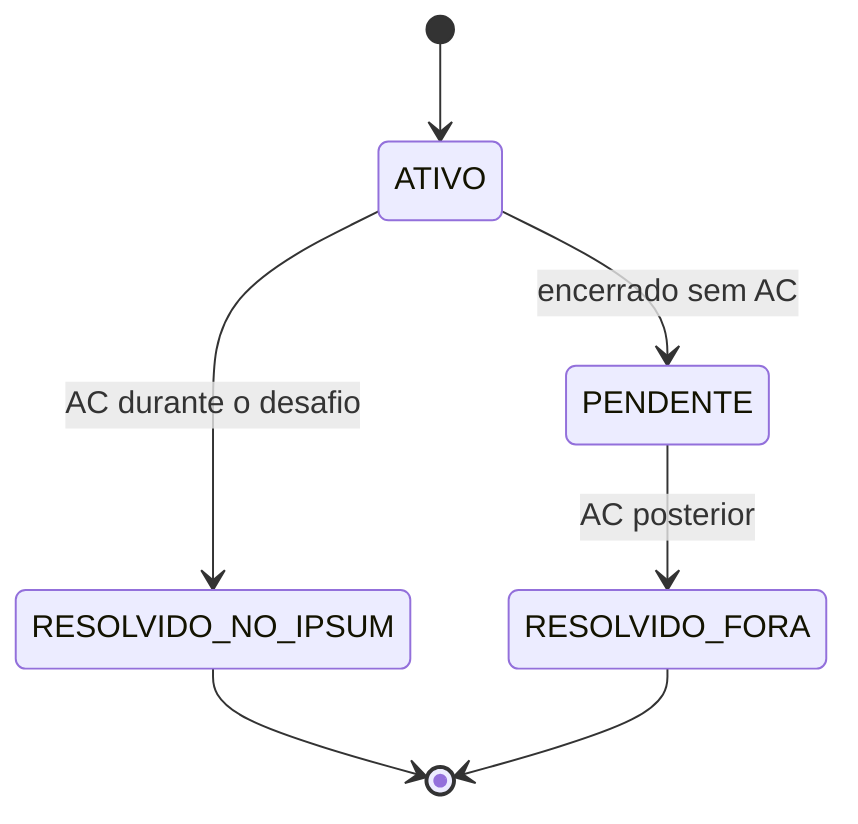

# Especificacao do produto Lorem

> Fonte de verdade para visao, escopo e regras funcionais estaveis. Consulte somente
> a secao relacionada a regra em alteracao. Progresso fica em [`ROADMAP.md`](ROADMAP.md)
> e escolhas em aberto ficam em [`DECISIONS.md`](DECISIONS.md).

## 2. Visao do produto

**Lorem** e um aplicativo Android de treino individual para programacao competitiva.

O aplicativo recomenda um exercicio inedito do Codeforces de acordo com o nivel do usuario, inicia um desafio cronometrado chamado **Ipsum**, acompanha as submissoes e produz feedback sobre dificuldade, tempo, uso de dica, rating e assuntos praticados.

### Problemas que o Lorem resolve

- O usuario nao quer escolher manualmente qual exercicio praticar.
- Exercicios aleatorios podem ser inadequados ao nivel atual.
- Resolver sempre os mesmos estilos cria uma falsa sensacao de dominio.
- O rating oficial do Codeforces depende de contests e nao mede diretamente o treino avulso.
- O usuario precisa aprender a administrar o tempo de resolucao.
- Problemas nao resolvidos precisam permanecer visiveis para estudo e upsolve.

### Publico principal

Competidores de nivel iniciante-intermediario ou intermediario que ja utilizam o Codeforces, desejam praticar com frequencia e querem feedback sobre sua capacidade real fora de contests.

### Promessa central

> Guiar o usuario por exercicios variados e adequados ao seu nivel ate que ele se torne confortavel com diferentes raciocinios em tempo de competicao.

### Prioridades do projeto

1. Fluxo completo do Ipsum funcionando.
2. Correcao dos dados e das regras.
3. Utilidade real para o treinamento.
4. Simplicidade de desenvolvimento e manutencao.
5. Aparencia visual.

---

## 3. Escopo fechado

### Dentro do escopo

- Um perfil local ligado a um handle publico do Codeforces.
- Consulta ao catalogo de problemas e ao historico de submissoes.
- Exclusao de qualquer exercicio ja tentado ou resolvido pelo usuario.
- Recomendacao automatica de um exercicio.
- Apenas um Ipsum ativo por vez.
- Cronometro persistente.
- Tags escondidas, com opcao de revela-las como dica.
- Verificacao das submissoes feitas durante o Ipsum.
- Resultado e alteracao do rating interno.
- Historico de resolvidos durante Ipsums.
- Lista de problemas encerrados sem AC.
- Deteccao de AC obtido posteriormente, fora do Ipsum.
- Estatisticas por rating, tempo, resultado, dica e tags oficiais do Codeforces.
- Recomendacao que favorece variedade e pontos fracos.
- Indicacao de consolidacao da faixa de rating.

### Fora do escopo

- Equipes, duelos ou ranking entre usuarios.
- Contests, simulados ou treinos coletivos dentro do aplicativo.
- Chat, editorial ou geracao de dicas por inteligencia artificial.
- Tags criadas manualmente pelo Lorem.
- Editor ou compilador de codigo dentro do aplicativo.
- XP, moedas, streaks, conquistas ou loja.
- Login com senha, rede social ou backend proprio, salvo decisao posterior registrada.
- Firebase, sincronizacao em nuvem ou multiplos dispositivos, salvo decisao posterior registrada.
- Recursos especulativos apresentados como "versao futura".

---

## 4. Glossario e regras de dominio

- **Lorem:** o aplicativo inteiro.
- **Ipsum:** uma tentativa oficial e cronometrada de resolver um problema recomendado.
- **Rating Lorem:** estimativa interna da capacidade individual do usuario fora de contests.
- **Rating Codeforces:** dificuldade atribuida pelo Codeforces a um problema ou rating competitivo oficial do usuario. Nao confundir com o Rating Lorem.
- **Dica de topicos:** revelacao das tags oficiais do problema no Codeforces.
- **Tentado anteriormente:** problema que possui qualquer submissao anterior ao inicio do Ipsum, com qualquer veredito.
- **Resolvido no Ipsum:** primeiro AC ocorreu entre o inicio e o encerramento daquele Ipsum.
- **Pendente:** Ipsum encerrado sem AC.
- **Resolvido fora do Ipsum:** problema pendente que recebeu AC posteriormente.
- **Rating estimado:** valor numerico calculado pelas tentativas recentes.
- **Faixa consolidada:** maior faixa na qual o usuario demonstrou consistencia e variedade suficientes.

### Identidade de um problema

Sempre identificar um problema pela combinacao estavel fornecida pelo Codeforces, preferencialmente `contestId + index`. Nunca usar apenas o nome.

### Estados permitidos de um Ipsum



Regras invariantes:

- So pode existir um Ipsum ativo.
- Submissoes anteriores ao inicio nunca contam para o Ipsum atual.
- Um Ipsum encerrado nao pode alterar o rating pela segunda vez.
- Resolver posteriormente move o item de lista, mas nao reavalia o rating original.
- Rating, tags e categoria do sorteio ficam escondidos enquanto o Ipsum esta ativo.

---

## 5. Regras confirmadas de recomendacao

Considere `R` como o Rating Lorem atual.

### Distribuicao de dificuldade

- 1/3 de chance de **fluencia**: `max(800, R - 200)` ou `max(800, R - 100)`.
- 1/3 de chance de **nivel atual**: aproximadamente `R`.
- 1/3 de chance de **desafio**: `R + 100` ou `R + 200`.

A categoria sorteada nao deve ser mostrada durante o Ipsum.

### Filtros obrigatorios

O problema precisa:

- possuir rating;
- nunca ter recebido submissao anterior do usuario;
- nunca ter participado de outro Ipsum;
- nao estar pendente;
- nao ser o problema do Ipsum ativo.

### Prioridade de variedade

Depois dos filtros e da faixa de dificuldade, favorecer nesta ordem:

1. tags nunca praticadas;
2. tags pouco praticadas;
3. tags com maior taxa de falha;
4. tags nas quais o usuario usa dica com frequencia;
5. tags ja dominadas.

Usar apenas tags oficiais do Codeforces. Um problema com varias tags contribui para todas elas. A IA nao deve inventar uma taxonomia paralela.

### Quando nao houver candidato exato

Nao retornar erro imediatamente. Procurar progressivamente nos ratings vizinhos em passos de 100, mantendo todos os filtros de ineditismo. Registrar qual fallback foi utilizado. Os limites exatos desse fallback ainda estao em **Decisoes abertas**.

---

## 6. Dados minimos a preservar

Os nomes tecnicos podem mudar, mas o sistema precisa representar:

- **Perfil:** handle, Rating Lorem, faixa consolidada e ultima sincronizacao.
- **Problema:** `contestId`, `index`, nome, rating, tags e URL.
- **Ipsum:** problema, rating inicial, categoria, horarios, estado, dica, submissoes, erros, tempo, motivo do fracasso, variacao de rating e eventual AC posterior.
- **Desempenho por tag:** tentativas, AC no Ipsum, pendencias, uso de dica, tempo medio e faixa de rating.

---

## 7. Base tecnica recomendada

Opcao inicial para manter o TCC simples; preservar outra estrutura se o repositorio ja possuir uma funcional:

- Kotlin, Compose, um modulo, ViewModel + StateFlow e Coroutines.
- Room para dados estruturados e DataStore para pequenas configuracoes.
- Cliente HTTP centralizado, Navigation Compose e injecao manual simples.
- Sem Hilt ou backend proprio apenas por padrao.

### Endpoints necessarios do Codeforces

- `user.info`: validar e carregar o usuario.
- `user.status`: importar e atualizar submissoes.
- `problemset.problems`: carregar problemas, ratings e tags.

A API publica retorna `OK` ou `FAILED` e permite no maximo uma chamada a cada dois segundos. Centralizar chamadas e limitar a frequencia; nao deixar cada tela consultar livremente.

### Comandos de verificacao esperados

Este repositorio nao versiona o Gradle Wrapper para evitar artefatos binarios. Use Gradle 8.11 ou superior com Java 17:

```bash
gradle test
gradle lint
gradle assembleDebug
```

No Windows sem WSL, use os mesmos comandos em um terminal no qual o Gradle esteja disponivel no `PATH`.

---

## 13. Metodo de avaliacao do TCC

Antes e depois de um periodo de uso, avaliar: exercicios tentados, AC durante Ipsums, tempo medio, AC sem dica, variedade de tags, desempenho por rating, upsolves e percepcao sobre confianca e controle do tempo.

Nao afirmar que o Lorem melhora aprendizagem apenas com base em rating interno. Separar metricas objetivas de percepcao subjetiva e documentar as limitacoes da avaliacao.

---

## Referencias metodologicas

Esta documentacao aplica instrucoes persistentes, desenvolvimento orientado por
especificacao, criterios de aceite, checklists verificados, registro de decisoes e
pequenas entregas verticais.

- OpenAI, `AGENTS.md`: https://learn.chatgpt.com/docs/agent-configuration/agents-md
- GitHub Spec Kit: https://github.com/github/spec-kit
- GitHub, instrucoes para agentes: https://docs.github.com/en/copilot/how-tos/copilot-on-github/customize-copilot/add-custom-instructions/add-repository-instructions
- GitHub, task lists: https://docs.github.com/en/get-started/writing-on-github/working-with-advanced-formatting/about-tasklists
- Codeforces API: https://codeforces.com/apiHelp
